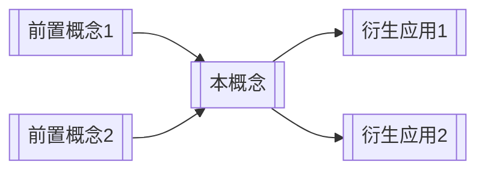

# 概念名称

## 摘要
（2-3 句话概括：这是什么、为什么重要、核心价值是什么）

## 定义
> **一句话定义**：用最精炼的语言描述这个概念的本质。

（详细阐述：展开说明概念的内涵和外延）

## 核心原理
（解释它为什么有效、如何运作的底层逻辑）

### 关键机制
1. **机制一**：（描述）
2. **机制二**：（描述）

## 关键特征

| 特征 | 说明 |
|------|------|
| 特征一 | 详细说明 |
| 特征二 | 详细说明 |
| 特征三 | 详细说明 |

## 知识图谱位置

## 与相关概念的关系

| 对比维度 | 本概念 | [[类似概念A]] | [[对立/互补概念B]] |
|---------|--------|-------------|------------------|
| 核心目标 | ... | ... | ... |
| 适用场景 | ... | ... | ... |
| 局限性 | ... | ... | ... |

## 应用场景
- ✅ **场景一**：（具体描述何时使用）
- ✅ **场景二**：（具体描述何时使用）
- ❌ **不适合**：（明确标注边界和反模式）

## 实践案例
> （如果有具体案例，在此记录）

## 局限性与风险
- ⚠️ 局限一：（诚实标注不足之处）
- ⚠️ 风险一：（可能的误用风险）

## 来源引用
- [来源文件] → 核心观点出处（段落/章节）
- [来源文件] → 数据支撑出处

## 待验证 / 开放问题
- _（如有未确认的信息或需要进一步研究的问题）_

---
*最后更新: YYYY-MM-DD*
