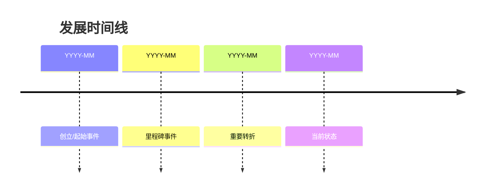
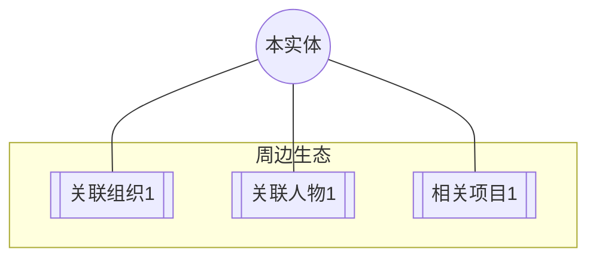

# 实体名称

## 摘要
（2-3 句话概括：这是谁/什么、做什么的、为何值得关注）

## 基本信息

| 属性 | 内容 |
|------|------|
| 类型 | 人物 / 组织 / 项目 / 产品 / 工具 / 其他 |
| 别名/英文名 | ... |
| 所属领域 | [[领域实体]] |
| 成立时间/时期 | ... |
| 官方链接 | [URL](url) |

## 概述
（2-4段话全面介绍该实体的背景、发展历程、现状）

## 核心贡献 / 主要特点

### 贡献 1：名称
（详细说明）

### 贡献 2：名称
（详细说明）

### 贡献 3：名称
（详细说明）

## 时间线

## 关联关系图

## 关键数据 / 评价指标
| 指标 | 数值 | 时间点 | 来源 |
|------|------|--------|------|
| ... | ... | ... | ... |

## 评价与争议
- 👍 **正面评价**: ...
- 👎 **争议/批评**: ...
- ⚖️ **客观分析**: ...

## 相关资源
- 📄 [资源名称](url) — 说明
- 🎥 [视频/播客](url) — 说明
- 📰 [文章](url) — 说明

## 来源引用
- [来源文件] → 信息出处

---
*最后更新: YYYY-MM-DD*
